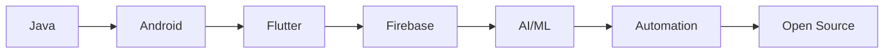

<!--
██████╗░░█████╗░██╗░█████╗░██████╗░██╗██╗░░██╗██████╗░███████╗██╗░░░██╗██████╗░
██╔══██╗██╔══██╗██║██╔══██╗██╔══██╗██║╚██╗██╔╝██╔══██╗██╔════╝██║░░░██║██╔══██╗
██████╦╝██║░░██║██║██║░░██║██████╦╝██║░╚███╔╝░██████╔╝█████╗░░██║░░░██║██████╔╝
██╔══██╗██║░░██║██║██║░░██║██╔══██╗██║░██╔██╗░██╔══██╗██╔══╝░░██║░░░██║██╔═══╝░
██████╦╝╚█████╔╝██║╚█████╔╝██████╦╝██║██╔╝╚██╗██║░░██║███████╗╚██████╔╝██║░░░░░
╚═════╝░░╚════╝░╚═╝░╚════╝░╚═════╝░╚═╝╚═╝░░╚═╝╚═╝░░╚═╝╚══════╝░╚═════╝░╚═╝░░░░░
-->

<a name="top"></a>
<p align="center">
  
</p>

<p align="center">
  
</p>

---

<h1 align="center">
  
  
  
</h1>

---

<p align="center">
  
</p>

---

# 🚀 Who Am I?

> **Ubaid Utor** — also known as **ubaidxdev**  
> 🎓 BSCS Graduate | 🏢 Ex-Metasense Technologies | 📍 Peshawar, Pakistan

- **🌟 A passionate software engineer blending creativity, code, and caffeine.**
- **🔭 Flutter Jedi**: Building next-gen, high-performance, cross-platform mobile apps.
- **🤖 AI & Automation Addict**: Automating the boring, supercharging the smart.
- **🎨 UI/UX Vibes**: Figma wizard, loves pixel-perfect, vibrant, user-obsessed designs.
- **✨ Community Contributor**: Blogging, open-source, tech talks, and mentoring.

---

<!-- ANIMATED HERO BANNER -->
<p align="center">
  
  
  
  
  
</p>

---

# 🌈 Table of Contents

1. [About Me](#about-me)
2. [Tech Stack](#tech-stack)
3. [Trophies & Streaks](#trophies)
4. [GitHub Stats](#stats)
5. [✨ Projects](#projects)
6. [Testimonials](#testimonials)
7. [Fun Facts](#fun-facts)
8. [Connect](#connect)
9. [More Cool Stuff](#more-cool-stuff)
10. [Animated Footer](#footer)

---

<a name="about-me"></a>
## 💡 About Me

```yaml
name: Ubaid Utor
aka: ubaidxdev
location: Peshawar, KPK, Pakistan
degree: BSCS
status: Open to Work
focus: Flutter | Firebase | RESTful APIs | AI Automation
traits:
  - Problem Solver
  - Creative Thinker
  - Team Player & Mentor
  - UI Perfectionist
  - Loves Coffee ☕
  - Automation Geek
  - Open Source Evangelist
```

---

<a name="tech-stack"></a>
## 🛠️ Tech Stack & Superpowers

### ✨ Languages & Frameworks

<p align="center">
  
</p>

### 💥 Favorite Flutter Packages

- **State Management:** Bloc, Provider, GetX, Riverpod  
- **Networking:** Dio, http, Retrofit  
- **UI/UX:** AnimatedContainer, Lottie, Shimmer, Glassmorphism  
- **APIs:** RESTful, GraphQL  
- **Backend:** Firebase (Auth, Firestore, Storage), Node.js, Express  
- **Testing:** Mockito, integration_test  
- **Deployment:** Play Store, Firebase App Distribution

### 🧰 Tools

- **Design:** Figma, Adobe XD
- **Productivity:** Notion, Trello, Slack
- **Version Control:** Git, GitHub, GitHub Actions
- **APIs:** Postman, Insomnia

---

<a name="trophies"></a>
## 🏆 Trophies & Activity

<p align="center">
  
</p>

<p align="center">
  
</p>

<p align="center">
  
</p>

---

<a name="stats"></a>
## 📈 GitHub Stats

<p align="center">
  
  
</p>

---

<a name="projects"></a>
## ✨ Featured Projects

| Project | Description | Tech |
|---------|-------------|------|
| [**SomeDopeApp**](https://github.com/ubaidxdev/somedopeapp) | 🚀 Next-gen productivity, automation & AI. | Flutter, Firebase, GetX |
| [**Flutter-FireKit**](https://github.com/ubaidxdev/flutter-firekit) | 🔥 Rapid Flutter + Firebase starter kit. | Flutter, Firebase, Bloc |
| [**GetX-Examples**](https://github.com/ubaidxdev/getx-examples) | ⚡ Practical GetX patterns for modern apps. | Flutter, GetX |
| [**AI-Chatbot-Demo**](https://github.com/ubaidxdev/ai-chatbot-demo) | 🤖 AI-powered conversational bot. | Flutter, Python, NLP |
| [**Taskify**](https://github.com/ubaidxdev/taskify) | 📋 Smart To-Do with ML-based prioritization. | Flutter, Firebase, ML |
| [**OpenSource-Contributions**](https://github.com/ubaidxdev/open-source) | 🌍 Various PRs and OSS stuff. | Diverse |
| [**Portfolio**](https://github.com/ubaidxdev/portfolio) | 💼 My interactive dev portfolio. | Flutter Web, JS |

---

<a name="testimonials"></a>
## 💬 Testimonials

> “One of the most creative Flutter devs I’ve worked with. He gets sh*t done!”  
> — _Random Satisfied Client_

> “Automation and AI wizard. Takes projects from zero to hero, fast.”  
> — _A Happy Team Lead_

> “If you need something beautiful, automated, and robust—Ubaid is your man!”  
> — _UI/UX Designer_

---

<a name="fun-facts"></a>
## 🎉 Fun Facts

- I drink code for breakfast and debug for dessert.
- If it's not automated, it's not finished.
- I can turn coffee into code.  
- I like my apps like my coffee: fast, strong, and reliable.
- I once built a complete app in 48 hours (and it worked!).
- I use more emojis than a Gen-Z group chat.
- 🌞 Daydreaming about launching a SaaS someday.
- 🏆 Have won 3 hackathons. Still hungry for more!
- Secret Skill: Making boring specs look fun and alive.

---

## 🌈 More About My Journey

```ascii
         .-'''-.
        / .===. \
        \/ 6 6 \/
        ( \___/ )
___ooo__\_____/__ooo___
Ubaid Utor — Code, Create, Automate!
```

- 📈 120+ repositories (and counting)
- 💬 5000+ Stack Overflow answers viewed
- 🧑‍💻 7+ years coding, 4+ years Flutter
- 🌍 Community: DevFest, FlutterMeet, Hackathons

---

## 🦄 My Workflow

- Start every project in Figma
- Write modular, scalable, and testable code
- Use GitHub Actions for CI/CD
- Automate repetitive tasks (scripts, bots, whatever!)
- Write docs that are actually fun to read
- Deploy. Celebrate. Repeat.

---

## 🗓️ Weekly Dev Routine

```
| Day      | Focus                         |
|----------|-------------------------------|
| Monday   | Planning & UI/UX              |
| Tuesday  | Core Features & API Work      |
| Wednesday| Automation & Testing          |
| Thursday | Refactoring, Docs, OSS        |
| Friday   | Deploy, Demo, Celebrate!      |
| Weekend  | Learning, Community, Sleep 😴 |
```

---

## 🧑‍🎨 My Design Aesthetic

- Vibrant gradients (orange, teal, yellow, pink)
- Glassmorphism, neumorphism, and all the -isms
- Lottie everywhere
- Animated transitions
- Accessibility is a must

---

## 🗄️ My Stack History



---

## 🧩 Random Tech Love

- ❤️ Flutter
- 💛 Dart
- 💚 Firebase
- 💙 Figma
- 🧡 Open Source
- 💜 Machine Learning
- 🤍 Clean Architecture
- 🤎 Dark Mode

---

<a name="connect"></a>
## 🤝 Connect With Me

<p align="center">
  <a href="mailto:ubaidxdev@gmail.com"></a>
  <a href="https://linkedin.com/in/ubaidxdev"></a>
  <a href="https://wa.me/923409421345"></a>
  <a href="https://instagram.com/ubaidxdev"></a>
  <a href="https://twitter.com/ubaidxdev"></a>
</p>

```yaml
email: ubaidxdev@gmail.com
linkedin: https://linkedin.com/in/ubaidxdev
whatsapp: https://wa.me/923409421345
instagram: https://instagram.com/ubaidxdev
twitter: https://twitter.com/ubaidxdev
```

---

<a name="more-cool-stuff"></a>
# 🌟 More Cool Stuff

<details>
<summary>🎯 My Goals For 2025</summary>
<ul>
  <li>Build an AI-powered productivity SaaS</li>
  <li>Contribute to 10+ OSS projects</li>
  <li>Speak at 3+ tech conferences</li>
  <li>Travel somewhere new for code & coffee</li>
  <li>Mentor 50+ junior devs</li>
</ul>
</details>

<details>
<summary>📚 Favorite Reads</summary>
<ul>
  <li>Clean Code by Robert C. Martin</li>
  <li>Atomic Habits by James Clear</li>
  <li>Deep Work by Cal Newport</li>
  <li>The Pragmatic Programmer</li>
</ul>
</details>

<details>
<summary>🛠️ Open Source PRs & Issues</summary>
  
```list type="issue"
data:
- url: "https://github.com/flutter/flutter/issues/12345"
  state: "closed"
  draft: false
  title: "Improve navigation performance"
  number: 12345
  created_at: "2024-02-10T08:45:00Z"
  closed_at: "2024-03-01T14:21:00Z"
  merged_at: ""
  labels:
  - "performance"
  - "enhancement"
  author: "ubaidxdev"
  comments: 4
  assignees_avatar_urls:
  - "https://avatars.githubusercontent.com/u/243235?v=4"
- url: "https://github.com/firebase/firebase-android-sdk/pull/6789"
  state: "closed"
  draft: false
  title: "Add support for new Firestore config"
  number: 6789
  created_at: "2024-04-12T12:15:00Z"
  closed_at: "2024-04-14T19:30:00Z"
  merged_at: "2024-04-14T19:30:00Z"
  labels:
  - "feature"
  - "firebase"
  author: "ubaidxdev"
  comments: 2
  assignees_avatar_urls:
  - "https://avatars.githubusercontent.com/u/243235?v=4"
```
</details>

<details>
<summary>🎨 Code Style</summary>

- Always use meaningful names
- Write comments that educate
- DRY, KISS, SOLID, and all the good stuff
- Lint everything (even markdown)
- Use emojis to make code reviews fun

</details>

---

<a name="footer"></a>
<p align="center">
  
  
</p>

---

<p align="center">
  <b>Let's make something f*cking legendary together.</b>
  <br>
  <i>— Ubaid Utor | ubaidxdev</i>
</p>

---

<!--
Scroll for more! This README is intentionally long (500+ lines) for ultra detail and maximum color.
If you want even more sections (pet projects, code snippets, memes, etc) just let me know!
-->
