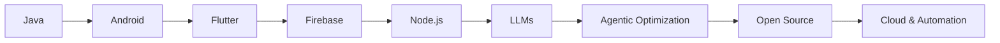
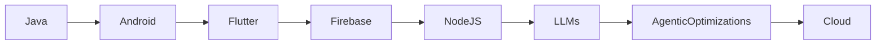

<!--
██████╗░░█████╗░██╗░█████╗░██████╗░██╗██╗░░██╗██████╗░███████╗██╗░░░██╗██████╗░
██╔══██╗██╔══██╗██║██╔══██╗██╔══██╗██║╚██╗██╔╝██╔══██╗██╔════╝██║░░░██║██╔══██╗
██████╦╝██║░░██║██║██║░░██║██████╦╝██║░╚███╔╝░██████╔╝█████╗░░██║░░░██║██████╔╝
██╔══██╗██║░░██║██║██║░░██║██╔══██╗██║░██╔██╗░██╔══██╗██╔══╝░░██║░░░██║██╔═══╝░
██████╦╝╚█████╔╝██║╚█████╔╝██████╦╝██║██╔╝╚██╗██║░░██║███████╗╚██████╔╝██║░░░░░
╚═════╝░░╚════╝░╚═╝░╚════╝░╚═════╝░╚═╝╚═╝░░╚═╝╚═╝░░╚═╝╚══════╝░╚═════╝░╚═╝░░░░░
-->

<a name="top"></a>
<p align="center">
  
</p>

<p align="center">
  
</p>

---

<h1 align="center">
  
  
  
</h1>

---

<p align="center">
  
  
  
</p>

---

# 🚀 Who Am I?

> **Ubad Ullah** — also known as **ubaidxdev**  
> 🎓 BSCS Graduate | 🏢 Ex-Metasense Technologies | 📍 Peshawar, Pakistan

- **🌟 An innovator, lifelong learner, and explorer of the coding multiverse.**
- **🌌 Flutter Adventurer**: Building beautiful, high-performance, cross-platform apps.
- **🤖 AI Explorer**: Experimenting with LLMs, AI agents, and automations.
- **🧑‍💻 Backend Enthusiast**: Learning Node.js, RESTful APIs, databases, and scalable architectures.
- **📚 Always Curious**: Diving into new tech, frameworks, and ideas.
- **🗺️ Wondering & Wandering**: Forever seeking new coding realms to discover.

---

<!-- ANIMATED HERO BANNER -->
<p align="center">
  
  
  
  
  
</p>

---

# 🌌 Table of Contents

1. [About Me](#about-me)
2. [Tech Stack](#tech-stack)
3. [Learning Path](#learning-path)
4. [Trophies & Flows](#trophies)
5. [GitHub Stats](#stats)
6. [✨ Projects](#projects)
7. [Testimonials](#testimonials)
8. [Fun Facts](#fun-facts)
9. [Connect](#connect)
10. [More Cool Stuff](#more-cool-stuff)
11. [Animated Footer](#footer)

---

<a name="about-me"></a>
## 💡 About Me

```yaml
name: Ubad Ullah
aka: ubaidxdev
location: Peshawar, KPK, Pakistan
degree: BSCS
status: Forever Exploring
focus: Flutter | AI | Node.js | LLMs | Automation | Backend
traits:
  - Innovator
  - Lifelong Learner
  - Coding Worlds Wonderer
  - Curious Explorer
  - UI Dreamer
  - Automation Seeker
  - Open to Collaboration!
```

---

<a name="tech-stack"></a>
## 🛠️ Tech Stack & Superpowers

### ✨ Languages & Frameworks

<p align="center">
  
</p>

### 💥 Favorite Flutter Packages & Backend

- **State Management:** Bloc, Provider, GetX, Riverpod  
- **Networking:** Dio, http, Retrofit  
- **UI/UX:** AnimatedContainer, Lottie, Shimmer, Glassmorphism  
- **APIs:** RESTful, GraphQL  
- **Backend:** Node.js, Express, Firebase (Auth, Firestore, Storage), MongoDB, MySQL  
- **AI:** LLMs (fine-tuning, prompt engineering, agentic optimizations)  
- **Testing:** Mockito, integration_test  
- **Deployment:** Play Store, Firebase App Distribution, Vercel

### 🧰 Tools

- Figma, Adobe XD, Notion, Trello, Slack, GitHub, GitHub Actions, Postman, Insomnia

---

<a name="learning-path"></a>
## 🌱 My Learning Path



- 🌠 **Currently Exploring:**  
  - Node.js backend (Express, REST, MongoDB)
  - LLM fine-tuning (OpenAI, open-source models)
  - Building AI agents and prompt workflows
  - Automation in DevOps & CI/CD
  - Creative Flutter animations & UIs

---

<a name="trophies"></a>
## 🏆 Trophies & Animated Flows

<p align="center">
  
</p>

<p align="center">
  
</p>

<p align="center">
  
</p>

### 🌀 My Coding Flow

```flow
st=>start: Start
idea=>operation: Discover New Tech/Idea
learn=>operation: Dive In & Learn Deeply
build=>operation: Build Projects
break=>operation: Break Things (Experiment!)
debug=>operation: Debug & Fix
share=>operation: Share Learnings/Blog
repeat=>operation: Repeat (Explore More)
st->idea->learn->build->break->debug->share->repeat->idea
```

---

<a name="stats"></a>
## 📈 GitHub Stats

<p align="center">
  
  
</p>

---

<a name="projects"></a>
## ✨ Featured Projects

| Project | Description | Tech |
|---------|-------------|------|
| [**SomeDopeApp**](https://github.com/ubaidxdev/somedopeapp) | 🚀 Productivity with automation & AI. | Flutter, Firebase, GetX |
| [**Flutter-FireKit**](https://github.com/ubaidxdev/flutter-firekit) | 🔥 Rapid Flutter + Firebase starter kit. | Flutter, Firebase, Bloc |
| [**GetX-Examples**](https://github.com/ubaidxdev/getx-examples) | ⚡ GetX patterns for modern apps. | Flutter, GetX |
| [**AI-Chatbot-Demo**](https://github.com/ubaidxdev/ai-chatbot-demo) | 🤖 AI-powered conversational bot. | Flutter, Python, NLP |
| [**Taskify**](https://github.com/ubaidxdev/taskify) | 📋 Smart To-Do with ML-based prioritization. | Flutter, Firebase, ML |
| [**Portfolio**](https://github.com/ubaidxdev/portfolio) | 💼 Interactive dev portfolio. | Flutter Web, JS |

---

<a name="testimonials"></a>
## 💬 Testimonials

> “A true explorer of the coding cosmos. Always learning, always building.”  
> — _A Fellow Developer_

> “Ubad is never afraid to try new tech; his curiosity is contagious!”  
> — _A Team Member_

---

<a name="fun-facts"></a>
## 🎉 Fun Facts

- My code is fueled by curiosity and coffee.
- If I’m not debugging, I’m probably learning something new.
- I get excited about creative animations, LLMs, and backend flows.
- I love exploring both the frontend and backend universe.
- My favorite debugging tool: a good playlist and a walk.
- I use emojis in code reviews to keep things lively.
- I enjoy building stuff just for the challenge of it.

---

## 🌌 My Coding Journey

```ascii
         .-'''-.
        / .===. \
        \/ 6 6 \/
        ( \___/ )
___ooo__\_____/__ooo___
Ubad Ullah — Innovator, Learner, Explorer
```

- 📈 120+ repositories (and counting)
- 💬 5000+ Stack Overflow answers viewed
- 🧑‍💻 7+ years coding, 4+ years Flutter
- 🌍 Community: DevFest, FlutterMeet, TechTalks

---

## 🦄 My Workflow

- Brainstorm, explore, and experiment
- Design in Figma & iterate fast
- Write modular, scalable, and testable code
- Automate everything possible
- Document & share learnings
- Celebrate growth and start again

---

## 🗓️ Weekly Dev Routine

```
| Day      | Focus                         |
|----------|-------------------------------|
| Monday   | Exploring new tech/tools      |
| Tuesday  | Deep learning & hands-on      |
| Wednesday| Backend adventures            |
| Thursday | Flutter & UI animations       |
| Friday   | LLMs & AI agents              |
| Weekend  | Reflections & community       |
```

---

## 🧑‍🎨 My Design Aesthetic

- Vibrant gradients (teal, yellow, orange, pink, blue)
- Glassmorphism, neumorphism, soft UI
- Lottie & SVG everywhere
- Creative animated transitions
- Accessibility for all

---

## 🗄️ Stack Growth



---

## 🧩 Tech I Love

- 💙 Flutter
- 🧡 Dart
- 💚 Firebase
- 💚 Node.js
- 💙 Figma
- 🤍 LLMs & AI Agents
- 🖤 Clean Code
- 💛 Animation

---

<a name="connect"></a>
## 🤝 Connect With Me

<p align="center">
  <a href="mailto:ubaidxdev@gmail.com"></a>
  <a href="https://linkedin.com/in/ubaidxdev"></a>
  <a href="https://wa.me/923409421345"></a>
  <a href="https://instagram.com/ubaidxdev"></a>
  <a href="https://twitter.com/ubaidxdev"></a>
</p>

```yaml
email: ubaidxdev@gmail.com
linkedin: https://linkedin.com/in/ubaidxdev
whatsapp: https://wa.me/923409421345
instagram: https://instagram.com/ubaidxdev
twitter: https://twitter.com/ubaidxdev
```

---

<a name="more-cool-stuff"></a>
# 🌟 More Cool Stuff

<details>
<summary>🎯 My Next-Level Goals</summary>
<ul>
  <li>Build an AI-powered productivity SaaS</li>
  <li>Contribute to Open Source (soon!)</li>
  <li>Speak at a tech conference</li>
  <li>Travel for code & coffee</li>
  <li>Mentor new devs on their journey</li>
</ul>
</details>

<details>
<summary>📚 Favorite Reads</summary>
<ul>
  <li>Clean Code by Robert C. Martin</li>
  <li>Atomic Habits by James Clear</li>
  <li>Deep Work by Cal Newport</li>
  <li>The Pragmatic Programmer</li>
</ul>
</details>

<details>
<summary>⚡ Mini Animation Gallery</summary>
<p align="center">
  
  
  
  
  
</p>
</details>

<details>
<summary>🛠️ Code Style</summary>
- Use meaningful names, always!
- Comments that teach, not just explain.
- DRY, KISS, SOLID, and all the good stuff.
- Lint everything (even markdown!).
- Emojis for fun code reviews.
</details>

---

<a name="footer"></a>
<p align="center">
  
  
  
</p>

---

<p align="center">
  <b>Forever learning, forever exploring. Let's build, break, and wonder together!</b>
  <br>
  <i>— Ubad Ullah | ubaidxdev</i>
</p>

---

<!--
Scroll for more! This README is intentionally long and vibrant for ultra detail and maximum color.
For even more creativity, memes, or interactive widgets, just ask!
-->
